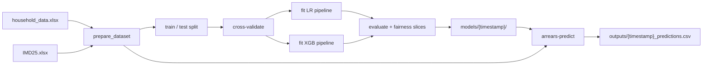

# Arrears Risk Model

Batch ML pipeline for predicting household rent arrears risk across Lewisham council's housing and benefits caseload. Outputs a ranked priority list for caseworker outreach — every score is reviewed by a human before any contact or resource allocation decision is made.

Two models are trained in parallel:

| Model | Role |
|---|---|
| Logistic regression | Interpretable baseline; useful for explaining individual scores |
| XGBoost | Primary scoring model; better ranking performance on held-out data |

See [`docs/model_card.md`](docs/model_card.md) for intended use, training data, evaluation metrics, equity overlay, fairness approach, and monitoring guidance.

## Pipeline overview



## Repository layout

```
.
├── src/arrears_risk_model/   # config, schemas, data, features, models, evaluate, train, predict
├── tests/                    # pytest suite (synthetic fixtures — no real data required)
├── notebooks/                # EDA, clustering, and modelling notebooks
├── config/default.yaml       # all tunable settings
├── data/                     # input files (gitignored — see data/README.md)
├── docs/model_card.md        # model card
├── models/                   # trained pipeline artefacts (gitignored)
└── outputs/                  # ranked priority lists (gitignored)
```

## Installation

Requires Python ≥ 3.12 and [uv](https://docs.astral.sh/uv/).

```bash
uv sync        # production dependencies
uv sync --dev  # + pytest and ruff
```

## Training

```bash
arrears-train                             # default config; writes to models/{timestamp}/
arrears-train --config path/to/my.yaml   # custom config file
arrears-train --model-dir /tmp/models    # override output directory
```

Equivalent: `uv run python -m arrears_risk_model.train`.

## Prediction

```bash
arrears-predict                   # score with XGBoost pipeline (default)
arrears-predict --model lr        # use logistic regression instead
arrears-predict --output-dir /tmp # override output directory
```

Reads input data from `data/`, loads the most recently trained pipeline from `models/`, applies the equity overlay, and writes a ranked CSV to `outputs/`.

Equivalent: `uv run python -m arrears_risk_model.predict`.

## Configuration

All settings are in `config/default.yaml`. Any field can be overridden at runtime with an `ARM_`-prefixed environment variable using `__` as the nested delimiter:

```bash
ARM_TRAINING__RANDOM_STATE=7    arrears-train
ARM_EQUITY__CHILDREN=0.1        arrears-predict
ARM_PATHS__MODEL_DIR=/tmp/runs  arrears-train
```

## Tests

```bash
uv run pytest
```

The suite runs entirely on synthetic 50-row fixtures. No real data files are needed.

## Linting

```bash
uv run ruff check src/ tests/
```
